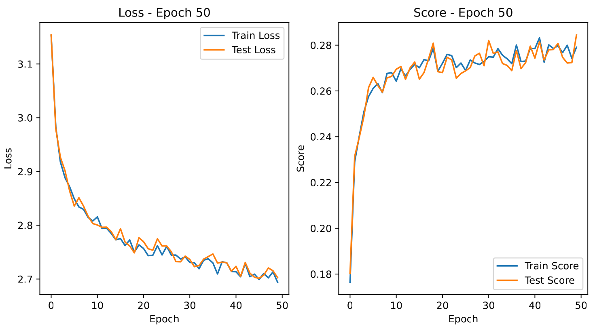

# NanoBERT
A simple implementation of BERT to imrpove our understanding.

**Co-authors**: [Mounes Zaval](https://github.com/mouneszawal), [Zeynep Akkoc](https://github.com/akkocz17)

## Details
We implemented a simple minimalist BERT model with [ALiBi](https://arxiv.org/abs/2108.12409), we added a [class](./mlm_model.py) that adds an MLM head and trained the model on an Arabic corpus treating each letter as a token.

## Training over Epochs

*The graph above illustrates the train / test loss and scores of our NanoBERT model over 50 epochs. The decreasing trend in loss indicates the model's improving ability to predict masked tokens in the Quran dataset.*

## Usage
To train the model with the provided configurations, use the following command:
```bash
train.py --model_config_path configs/model_config.json --tokenizer_config_path configs/tokenizer_config.json --train_config_path configs/train_config.json --data_path data/quran.jsonl
```
This command specifies the paths to the model, tokenizer, and training configurations, as well as the data to be used for training. The model will be trained according to the specified configurations.
